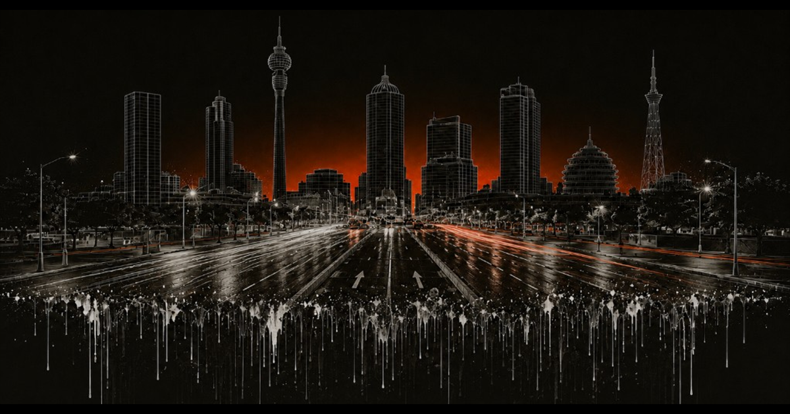

# Cursor South Africa



The official website for **Cursor South Africa** — the local community for builders using [Cursor](https://cursor.com) across Mzansi. We run Cafe Cursor meetups, workshops, and community events in Johannesburg, Cape Town, and beyond.

This site is built on the content-driven [Cursor Ambassador Evergreen](https://github.com/luisfer/cursor-ambassador-evergreen) Next.js template.

## Quick Start

```bash
pnpm install
pnpm run dev
```

Open `http://localhost:3000`.

## Editing the Site (Start Here)

Almost everything is configured by editing files in `content/`. Look for `TODO` comments — they mark the values you should replace with real Cursor South Africa details.

| What you want to change | File to edit |
| --- | --- |
| Community name, city, Luma URL, footer text | `content/site.config.ts` |
| Hero photo grid | `content/header-photos.ts` (+ images in `public/images/events/`) |
| Featured card (workshop/guide/signup) | `content/featured.ts` |
| Upcoming & past events | `content/events.ts` |
| Event recaps | `content/recaps/*.ts` (+ register in `content/recaps/index.ts`) |
| Ambassador team | `content/ambassadors.ts` (+ headshots in `public/images/ambassadors/`) |
| Hosting partners / sponsors | `content/partners.ts` (+ logos in `public/images/partners/`) |
| Global events carousel | `content/world-events.ts` |
| Page copy / labels | `content/locales/en.json` |

### Things to replace before launch

- `content/site.config.ts`: set the real `lumaUrl` for the Cursor South Africa calendar.
- `content/ambassadors.ts`: swap the placeholder names, roles, photos, and social links for the real team.
- `content/events.ts`: replace the sample events with real dates, venues, and Luma links.
- `content/partners.ts`: replace the placeholder venues (and their `public/images/partners/*.svg` logos) with real hosts/sponsors.
- `public/images/events/*`: swap in real photos from Cursor South Africa events.
- Set `NEXT_PUBLIC_SITE_URL` (in Vercel project settings) to the production domain so canonical URLs and social share images resolve.

## Project Structure

### App routes

- `app/page.tsx`: homepage composition (hero, ambassadors, featured, events, world events).
- `app/recaps/[slug]/page.tsx`: dynamic recap page route.
- `app/slides/[id]/page.tsx`: optional workshop slides route.

### Core components

- `components/HeroHeader.tsx`: top section + bento photo grid.
- `components/AmbassadorSection.tsx`: ambassador cards.
- `components/FeaturedSection.tsx`: featured resource card.
- `components/UpcomingEvents.tsx` and `components/PastEvents.tsx`: event lists.
- `components/Partners.tsx`: hosting partner cards/logos.
- `components/WorldEventsCarousel.tsx`: global event photos.

## Add or Remove Sections

Homepage order is defined in `app/page.tsx`. Remove a section by deleting its component from the page; add one by creating a component and inserting it. Keep the matching `content/` source files aligned with any component changes.

## Optional: Slides

A lightweight slide engine lives in `modules/slides/`.

- Data source: `modules/slides/content/example-deck.tsx`
- Route: `app/slides/[id]/page.tsx`

If we don't use slides, remove links to `/slides/*` from `content/featured.ts`.

## Deployment

### Vercel (recommended)

1. Push to GitHub.
2. Import the repository in Vercel.
3. Set `NEXT_PUBLIC_SITE_URL` to the production domain.
4. Deploy with default Next.js settings.

### Other platforms

```bash
pnpm run build
pnpm run start
```

## Credits

Cursor South Africa community site, maintained by the Cursor South Africa ambassadors.

Built on the [Cursor Ambassador Evergreen](https://github.com/luisfer/cursor-ambassador-evergreen) template, designed and implemented by [Luis Fernando Romero Calero](https://lfrc.me) and [Cursor](https://cursor.com).

## License

MIT. See `LICENSE`.
